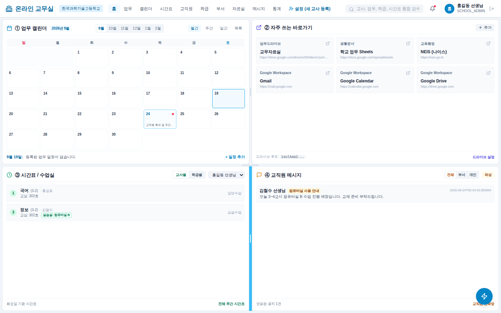
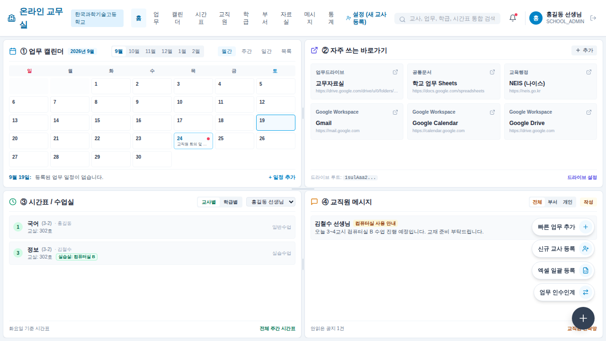
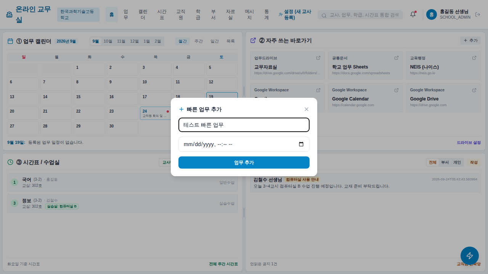
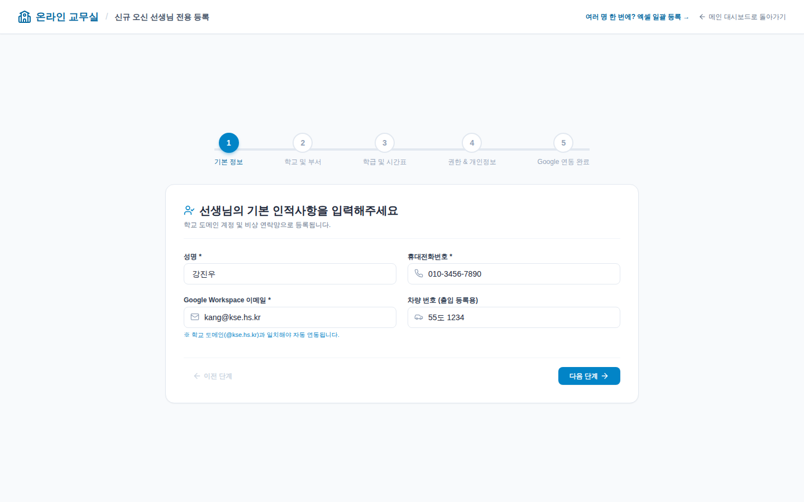
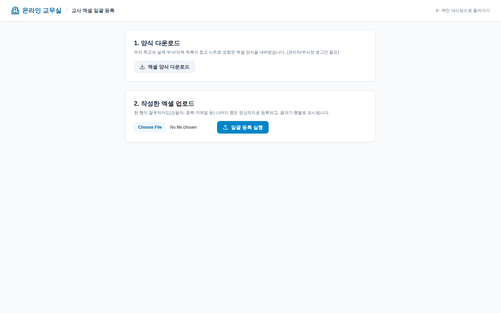
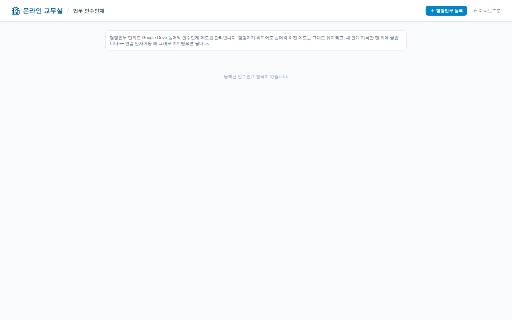
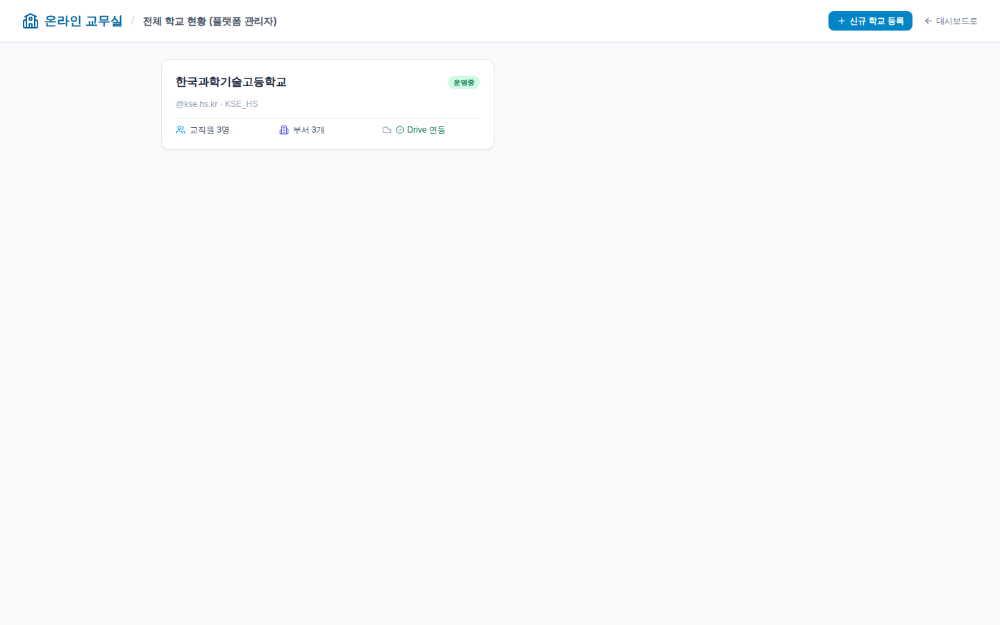

# 온라인 교무실 사용 안내서

처음 쓰시는 분들을 위한 화면별 간단 가이드입니다. 스크린샷은 실제 동작하는 화면을 캡처한 것입니다.

## 1. 로그인

학교 Google Workspace 계정이 있으면 구글 로그인 버튼으로, 없으면 이메일/비밀번호로 로그인합니다.
(비밀번호는 관리자가 교직원 등록 시 발급 — [Supabase/DB 설정 안내](../SUPABASE_SETUP.md)와는 별개입니다.)

## 2. 메인 대시보드 (4분할 화면)

로그인하면 한 화면에서 업무 캘린더(①) · 자주 쓰는 바로가기(②) · 시간표/수업실(③) · 교직원 메시지(④)를
모두 확인합니다. 캘린더는 월간/주간/일간/목록 4가지 보기를 지원합니다.

오른쪽 아래 **번개 모양 플로팅 버튼**을 누르면 자주 쓰는 화면(빠른 업무 추가/신규 교사 등록/엑셀
일괄등록/업무 인수인계/학교 관리)으로 클릭 한 번에 이동할 수 있습니다.

"+ 일정 추가"나 플로팅 버튼의 "빠른 업무 추가"를 누르면 페이지 이동 없이 팝업에서 바로 업무를
등록할 수 있습니다.

## 3. 신규 교사 등록 (5단계 마법사)

관리자/부서장이 로그인한 상태에서 이용합니다. 기본정보 → 부서 → 담임/시간표 → 권한 → 완료
순서로 진행하며, 완료 시 Google Drive 권한 부여와 시간표 초기 배정까지 한 번에 처리됩니다.

## 4. 여러 명 한꺼번에 등록 (엑셀 일괄등록)

신학기처럼 여러 명을 한 번에 등록해야 할 때 사용합니다. 먼저 우리 학교의 실제 부서/과목 목록이
반영된 엑셀 양식을 내려받고, 작성 후 업로드하면 됩니다. 한 행이 잘못되어도(오탈자 등) 나머지
행은 정상 등록되고 행별로 성공/실패가 표시됩니다.

## 5. 업무 인수인계

담당자가 바뀌어도 Google Drive 폴더와 이전 메모가 그대로 유지되는 인수인계 관리 화면입니다.
담당업무를 등록하면 부서(또는 학교) Drive 폴더 아래에 전용 하위 폴더가 자동 생성되고, "인수인계"
버튼으로 새 담당자를 지정하면 이전 메모 위에 새 인계 기록이 쌓입니다 — 연말 인사이동 때 특히
유용합니다.

## 6. 전체 학교 현황 (플랫폼 관리자 전용)

여러 학교로 확장할 때 쓰는 화면입니다. 플랫폼 관리자(SUPER_ADMIN)로 로그인하면 등록된 모든
학교의 교직원 수/부서 수/Drive 연동 여부를 한눈에 보고, 신규 학교를 코드 배포 없이 바로 등록할
수 있습니다.

---

## 참고: 로그인 계정 역할(RBAC) 요약

| 역할 | 할 수 있는 일 |
|---|---|
| `TEACHER` | 본인 업무/시간표 확인, 업무 생성, 메시지 송수신 |
| `DEPARTMENT_HEAD` | TEACHER + 소속 부서 교사 온보딩, 인수인계 관리 |
| `SCHOOL_ADMIN` | DEPARTMENT_HEAD + 학교 전체 교직원 관리 |
| `SUPER_ADMIN` | 모든 학교 관리 (신규 학교 등록 등) |

개인 쪽지(메시지)는 위 역할과 무관하게 **보낸 사람과 받는 사람만** 볼 수 있습니다 — 관리자도
개인 쪽지 내용을 열람할 수 없습니다.
